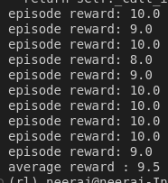

This repository hosts my (ongoing) implementations of RL algorithms. 
I am using 
- [gymnasium](https://gymnasium.farama.org/) for the environments. 
- pytorch for implementing the algorithm.

Implementations:

- I have implemented Policy Gradient with Baseline in [vpg.py](src/vpg/vpg.py). The weights for trained policy are stored in [saved-models](src/vpg/saved-models/vpg.pth). You can run [test.py](src/vpg/test.py) to run the agent with the saved policy.

  Results from the trained vpg model:
  [rl-demo.webm](https://github.com/ketvector/rl/assets/22502617/3f87d45a-584f-4ec5-bb74-a8f91e21d641)

  Before: 
